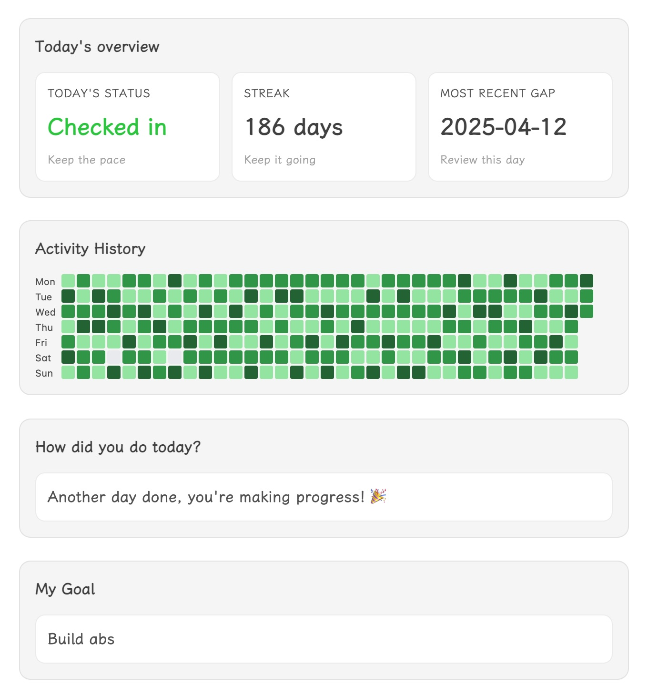

# Easy Tracker

English | [简体中文](./README.zh-CN.md) 

**Easy Tracker is an Obsidian plugin for ultra-simple goal and habit tracking in any note.**

Track progress toward a single goal directly inside one file—just insert the ready-made tracker modules and log your daily effort with one click. No setup, no system building: add all you need with a single command.

## What It Does

- Instantly insert a set of tracker modules (overview, heatmap, buttons, goal card) into any note.
- Log your daily progress by clicking a button—your check-ins are saved as plain text.
- Review streaks, gaps, and annual progress in a glance.
- Customize modules: add, remove, or rearrange blocks as you like.
- Supports English and Simplified Chinese, and lets you choose week start day.

## How To Use

1. Install and enable **Easy Tracker** in **Settings → Community plugins**.
2. Open any note you want to use for tracking.
3. Run the command palette and select `Insert Check-in Component` to add all modules at once.
4. Click a button each day to record your effort—no extra setup required.
5. Optionally, use commands to insert or remove individual modules.

## Modules

- **Daily overview**: Shows today's status, streak, and last missed day.
- **Year calendar heatmap**: Visualizes your annual progress.
- **Check-in buttons**: One-click logging; labels and values are editable.
- **Goal card**: Displays your motivational message.

All data is stored as plain text in your note—easy to search, sync, or edit.

## Customization

- Edit button labels/values by changing the text inside the block.
- Move or remove modules as you wish.
- Adjust language and week start in **Settings → Easy Tracker**.

No complex setup—just insert, click, and track.
