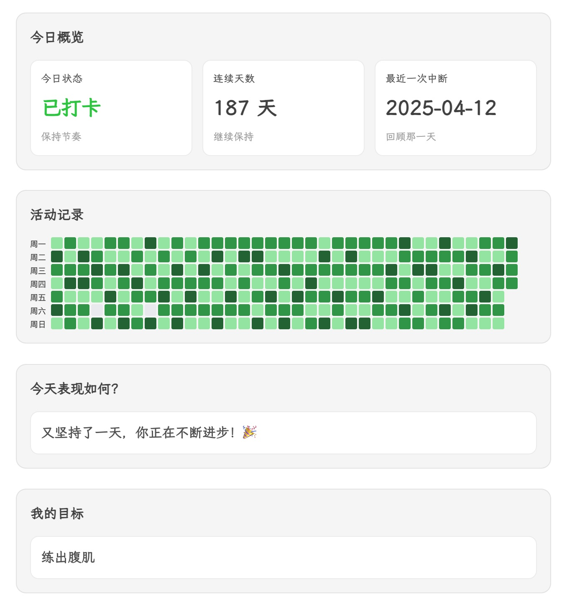

# Easy Tracker

[English](https://github.com/hunter-ji/obsidian-easy-tracker#easy-tracker)  | 简体中文

Easy Tracker 让你在 Obsidian 里轻松记录每日进展。把它当作习惯追踪、情绪打卡或目标日志，所有内容都保存在普通笔记中。

## 核心亮点
- 使用内置按钮块，一次点击即可完成当日打卡。
- 通过每日概览快速查看今日状态、连续天数以及最近一次中断。
- 用年度日历热力图一眼掌握全年趋势。
- 目标卡片帮助你始终牢记当前重点。
- 支持英文与简体中文界面，并可设置每周的起始日。

## 快速开始
1. 安装并在 **设置 → 社区插件** 中启用 **Easy Tracker**。
2. 打开想要存放打卡记录的笔记。
3. 打开命令面板，选择任一插入命令，例如 `Insert Check-in Component`。
4. 组件会出现在笔记中；切换到编辑模式即可看到按钮。
5. 点击按钮完成打卡，插件会写入一行类似 `* 2025-10-15 - 2` 的记录。

## 可用组件
- **每日概览**：显示今日是否打卡、当前连续天数和最近缺席日期。
- **年度日历热力图**：按颜色显示全年数据，帮助你把握节奏。
- **打卡按钮组**：一键选择不同程度；可以直接编辑块内的文字与数值。
- **我的目标**：在笔记中放置简短的激励语句。

你可以使用以下命令插入不同组合：
- `Insert Check-in Component`：一次加入概览、热力图、按钮组和目标卡片。
- `Insert Single Check-in Component`：加入概览、热力图以及单个按钮。
- `Insert Calendar Heatmap`、`Insert Daily Overview`、`Insert My Goal`：单独插入对应模块。

## 每日流程建议
1. 在日常笔记或专用面板中摆放需要的组件。
2. 每天点击最符合当日表现的按钮。
3. 查看每日概览，保持连续打卡。
4. 当需要激励时，用热力图回顾整体趋势。

## 个性化设置
- 修改按钮块中的文字即可改变标签与记录的数字。
- 将目标卡片移动到任意位置，写上与你最契合的提醒。
- 在 **设置 → Easy Tracker** 中切换界面语言或调整热力图使用的周起始日。

所有数据都存储在普通文本中，你可以自由整理、搜索或同步这些记录。
